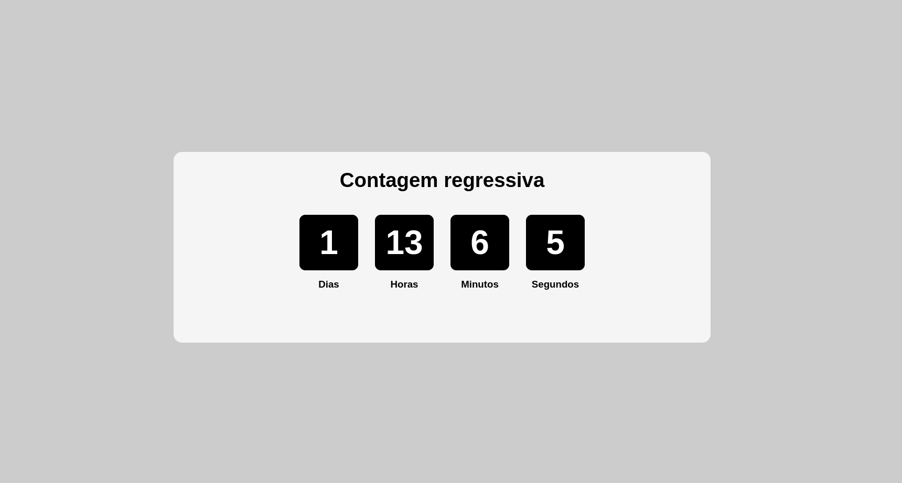

# Countdown 

## Projeto de contagem regressiva feito com ReactJs

  

# Funcionalidades

* Contagem regressiva da data escolhida

# Tecnologias Utilizadas

* JavaScript - Para lógica de programação 

* CSS - Para estilização da interface

# Conceitos Abordados

* Lógica e estilização

# Como utilizar

1- Clone o projeto
`git@github.com:helen-andrade/countdown.git`

2- Instale as dependências
`npm i`

3- Rode o script de desenvolvimento
`npm run dev`

---

    
Feito com ♡ por Helen Andrade

